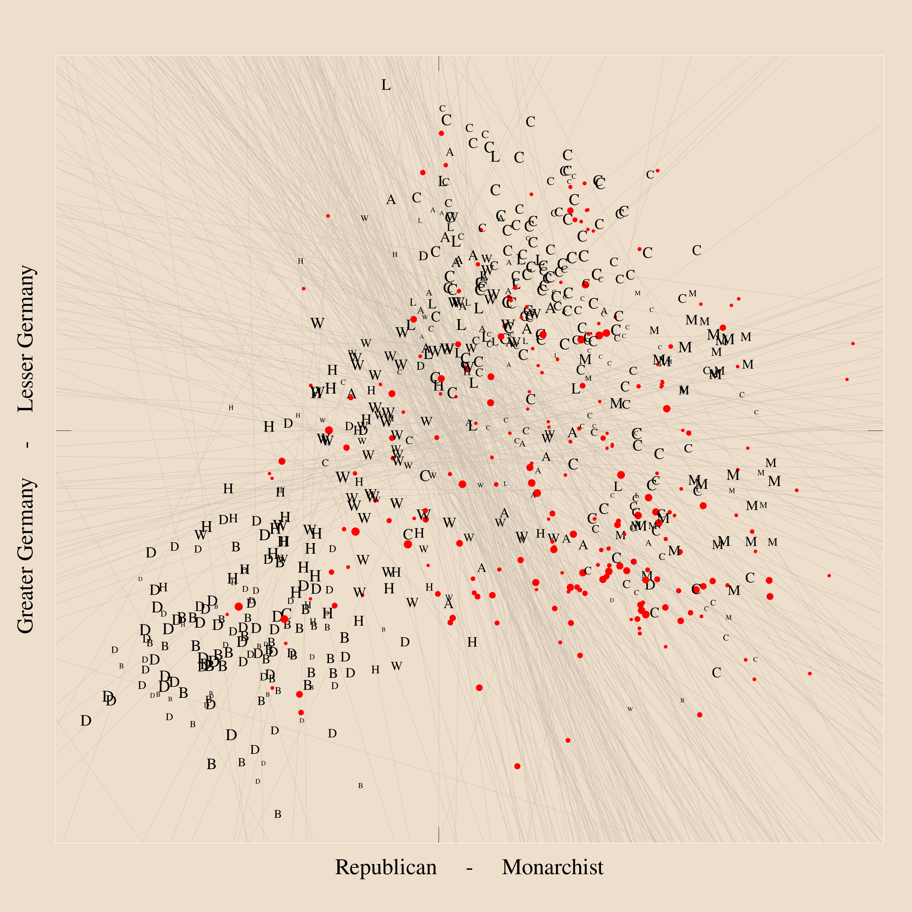

# Scaling the Frankfurt Assembly of 1848/49

## About

Generate a political map from recorded votes.

Re-implementation of the following article's main analysis with state-of-the-art Bayesian methods using the statistical computing platform and language [Stan](https://mc-stan.org)

Herrmann, Michael and Ulrich Sieberer. 2019. "The basic space of a revolutionary parliament: Scaling the Frankfurt Assembly of 1848/49." Party Politics 25(6): 841-853. doi [10.1177/1354068817749778](https://doi.org/10.1177/1354068817749778)

## Install

Requires R (version 4.2 or later), Stan and the R-library [cmdstanr](https://mc-stan.org/cmdstanr/)

To run the entire analysis: [run-all.r](run-all.r)

All analysis code is in [code/](code/) with R-scripts numbered to indicate precedence. After an initial run-all, each R-script can be run on its own.

(Note: Estimation with Stan may take 60+ minutes)

## Data

Running the analysis will retrieve all necessary raw data files from the following source and store them locally in [data/raw](data/raw)

Herrmann, Michael, Ulrich  Sieberer, Simon  Richter and Christian Spinner. 2023. "Voting in the Frankfurt Assembly Dataset". Harvard Dataverse, V2. doi [10.7910/DVN/E8XB5N](https://doi.org/10.7910/DVN/E8XB5N)

See [data-sources.csv](data-sources.csv) for the exact urls and storage paths.

## Results

[results/members-positions.csv](results/members-positions.csv) -- Members' estimated positions (incl. credibility intervals) along both dimensions of conflict

[results/votes-parameters.csv](results/votes-parameters.csv) -- Votes' estimated location and discrimination parameters (incl. credibilty intervals) along both dimensions

[results/estimates-summary.csv](results/votes-parameters.csv) -- Summary statistics (posterior means, medians, quantiles, R-hat, ESS, etc.) for estimated parameters

[results/estimation-output](results/estimation-output) --
Raw output (CSV-tables with posterior samples and diagnostics) will be stored in this directory. Due to GitHub's space constraints, no raw output is provided in the repo

[results/dimensions.png](results/dimensions.png) -- Scree plot of first 10 eigenvalues of voting agreement matrix (to asses the likely number of dimensions)

[results/map-fa.png](results/map-fa.png) -- Political map of the Frankfurt Assembly: visualization of members' positions and votes' dividing lines (computed from vote parameters), including information on political affiliation (letters: clubs; dots: unaffiliated) and number of votes participated in (marker sizes)
